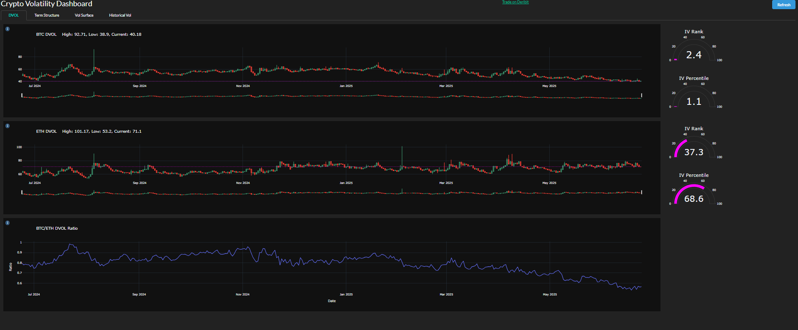

# Crypto Volatility Dashboard

A web-based dashboard for visualizing cryptocurrency volatility metrics—Deribit DVOL index, historical volatility cones, volatility term structure, and 3D implied volatility surface—built with Python, Plotly Dash, and Deribit API.


---

## 📋 Overview

This project provides interactive charts and analytics for key volatility measures on major cryptocurrencies. It fetches data from Deribit’s public REST API and historical price sources, processes volatility metrics, and serves a dynamic web interface via Dash. Users can:

- Monitor the DVOL index (implied volatility) with candlestick charts and IV Rank/Percentile gauges.
- Explore historical volatility cones using close-to-close and Parkinson estimators.
- Visualize the implied volatility term structure across expiries.
- Interact with a 3D implied volatility surface plotted over expiry and delta.

---
## 🧰 Tech Stack

- Backend: Python 3.9+

- Web Framework: Plotly Dash

- Visualization: Plotly for 2D and 3D charts

- HTTP Client: requests for Deribit REST API calls

- Environment Management: pip and requirements.txt

---

## ⚙️ Features

- **Deribit API Integration**: Fetches DVOL time series and option book summaries with `api_functions.py`.
- **DVOL Analytics**: Displays daily DVOL candlestick chart; calculates and renders IV Rank and IV Percentile gauges.


- **Historical Volatility Cones**: Computes rolling historical volatility using both close-to-close and Parkinson methods over multiple window lengths; plots volatility cones with percentile shading.


- **Volatility Term Structure**: Builds ATM implied volatility term structure by fetching option data, filtering by ATM strikes, and inverting Black–Scholes to get IV for each expiry.


- **3D Vol Surface**: Constructs a three-dimensional surface of implied volatility across expiries and deltas, enabling interactive exploration of skew and term structure simultaneously.


- **Interactive Dash UI**: Tabbed layout (DVOL, HV Cones, Term Structure, Vol Surface) with dropdowns for asset selection and a manual refresh button, built with Dash Bootstrap components.

---

## 🚀 Getting Started

### Prerequisites

- Python 3.8 or later
- `pip` for package management
- No API keys required (public endpoints only)

### Installation

1. **Clone the repository**

   ```bash
   git clone https://github.com/youruser/crypto-vol-dashboard.git
   cd crypto-vol-dashboard
   ```

2. **Install dependencies**

   ```bash
   pip install -r requirements.txt
   ```

3. **Configure settings** Edit `settings.py` to ensure the Deribit endpoint is correct:

   ```python
   api_exchange_address = "https://www.deribit.com"
   ```

4. **Run the app**

   ```bash
   python main.py
   ```

5. **Access the dashboard** Open `http://127.0.0.1:8050` in your browser.

---

## 📁 Project Structure

```
├── api_functions.py    # Deribit REST API wrappers for DVOL and option data
├── functions.py       # Data processing and Plotly figure generators
├── main.py            # Dash app layout, callbacks, and server entry point
├── settings.py        # API endpoint configuration
├── requirements.txt   # Python libraries
```

---

## 🛠 How It Works

1. **Data Fetching**

   - `api_functions._get_json()` sends GET requests to Deribit and returns parsed results.
   - `get_volatility_index_data()` retrieves DVOL index series; `get_book_summary_by_currency()` fetches order book summaries.

2. **Metric Calculations** (`functions.py`)

   - **DVOL Charts**: `dvol_charts()` builds OHLC candlestick charts, computes IV Rank and Percentile, and renders gauges.
   - **Historical Volatility**: `hv_charts()` calculates rolling volatilities for specified windows and plots volatility cones with percentile bands.
   - **Term Structure**: `vol_term_structure()` filters ATM strikes, computes implied vol via binary search on Black–Scholes, and plots IV vs. expiry.
   - **Vol Surface**: `vol_surface()` extends term structure into 3D by adding delta and plotting a surface mesh.

3. **Dash App** (`main.py`)

   - Defines tabs for each analytics view using Bootstrap components.
   - Dropdown menus allow switching the underlying asset and adjusting view parameters.
   - A refresh button triggers callbacks to re-fetch data and update all figures.

---

## 🔧 Customization

- **Auto-Refresh**: Add `dcc.Interval` in `main.py` to enable scheduled auto-updates.
- **Additional Assets**: Extend API calls and dropdown options to support more cryptocurrencies.
- **Styling**: Customize CSS in `assets/` and adjust Bootstrap theme as desired.

---

## 📜 License

MIT License

---

## ✍️ Contributing

Contributions are welcome! Please open issues or send pull requests for new features or bug fixes.

---

*Last updated: 2025-07-05*

